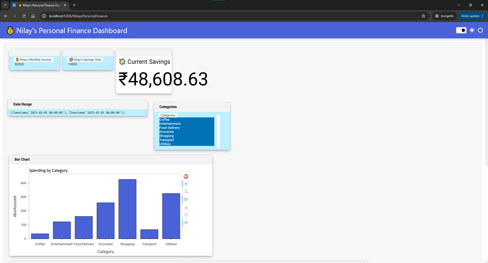
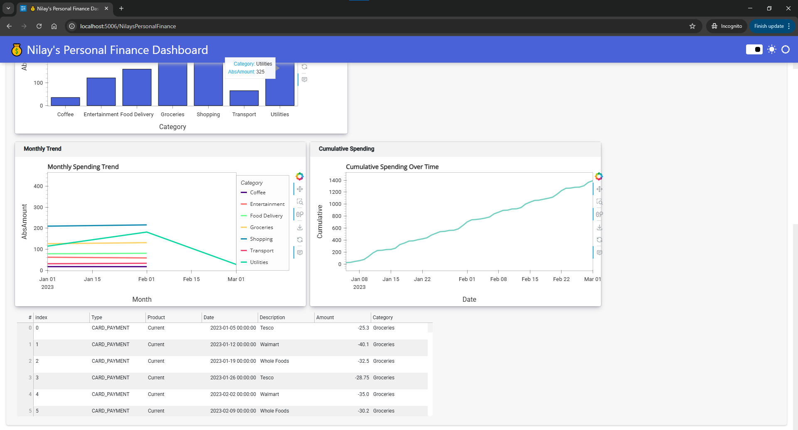

# Nilay's Personal Finance Dashboard

An interactive, modern web dashboard for tracking and visualizing personal spending, built with Python, Panel, HoloViews, and Pandas.



## Features

- Interactive filters: date range and category multi-select
- Summary widgets: income, current savings, and progress
- Visualizations: bar chart, monthly trend, cumulative spending
- Responsive, modern design with sidebar navigation
- Easy to customize and extend

## Installation

1. Clone the repo:
   ```
   git clone https://github.com/yourusername/financedash.git
   cd financedash
   ```

2. Install dependencies:
   ```
   pip install -r requirements.txt
   ```

3. Run the dashboard:
   ```
   panel serve your_dashboard_file.py
   ```
   or, if using a notebook:
   ```
   panel serve your_dashboard_file.ipynb
   ```

4. Open the provided local URL in your browser.

## Requirements

- Python 3.8+
- panel
- holoviews
- hvplot
- pandas
- numpy

## License

[MIT](LICENSE)

## Acknowledgements

- [Panel](https://panel.holoviz.org/)
- [HoloViews](https://holoviews.org/)
- [hvPlot](https://hvplot.holoviz.org/)
- [Pandas](https://pandas.pydata.org/)
